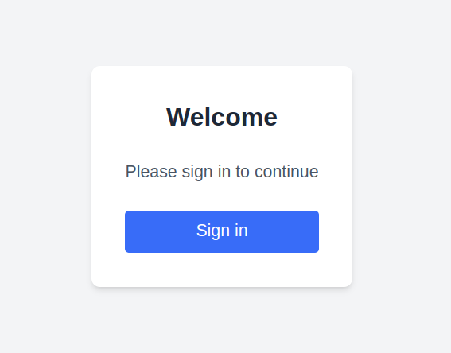

# Next.js Authentication with NextAuth.js

This project demonstrates how to implement authentication in a Next.js application using NextAuth.js with GitHub as the authentication provider.

## Installation

1. **Clone the repository:**
   ```bash
   git clone <repository-url>
   ```
2. **Navigate to the project directory:**
   ```bash
   cd your-project-name
   ```
3. **Install dependencies:**
   ```bash
   npm install
   ```

## Configuration

Create a `.env.local` file in the root of your project and add the following environment variables:

```env
GITHUB_ID=your_github_client_id
GITHUB_SECRET=your_github_client_secret
NEXTAUTH_URL=http://localhost:3000
```

## Implementation

### Setting up NextAuth in Next.js

Create a new API route for authentication in `app/api/auth/[...nextauth]/route.js`:

```javascript
import NextAuth from 'next-auth';
import GithubProvider from 'next-auth/providers/github';

const handler = NextAuth({
  providers: [
    GithubProvider({
      clientId: process.env.GITHUB_ID,
      clientSecret: process.env.GITHUB_SECRET,
    }),
  ],
});

export { handler as GET, handler as POST };
```

### Creating a Session Wrapper

In `app/Sessionwrapper.js`, create a wrapper component to provide session support across the application:

```javascript
"use client";
import { SessionProvider } from "next-auth/react";

const Sessionwrapper = ({ children }) => {
  return (
    <SessionProvider>
      {children}
    </SessionProvider>
  );
};

export default Sessionwrapper;
```

### Usage in the Application

Wrap your application with `Sessionwrapper` in `app/layout.js`:

```javascript
import Sessionwrapper from "./Sessionwrapper";

export default function RootLayout({ children }) {
  return (
    <html lang="en">
      <body>
        <Sessionwrapper>
          {children}
        </Sessionwrapper>
      </body>
    </html>
  );
}
```

### Protecting a Page

To protect a page and ensure only authenticated users can access it, use the `useSession` hook in a React component:

```javascript
"use client";
import { useSession, signIn, signOut } from "next-auth/react";

export default function Profile() {
  const { data: session } = useSession();

  if (!session) {
    return (
      <div>
        <p>You are not signed in</p>
        <button onClick={() => signIn()}>Sign in</button>
      </div>
    );
  }

  return (
    <div>
      <p>Welcome, {session.user.name}!</p>
      <button onClick={() => signOut()}>Sign out</button>
    </div>
  );
}
```

## Adding an Image of the Output

To include an image of the authentication UI in the README, follow these steps:

1. **Take a screenshot of the output.**
2. **Save the image in the `public` folder of your project.**
3. **Reference the image in the README using markdown:**
   ```md
   
   ```

Alternatively, if you upload the image to an external service like Imgur or GitHub, you can use the direct URL:

   ```md
   
   ```

## Running the Application

Start the development server:

```bash
npm run dev
```

Open [http://localhost:3000](http://localhost:3000) in your browser.

## License

This project is licensed under the MIT License.

